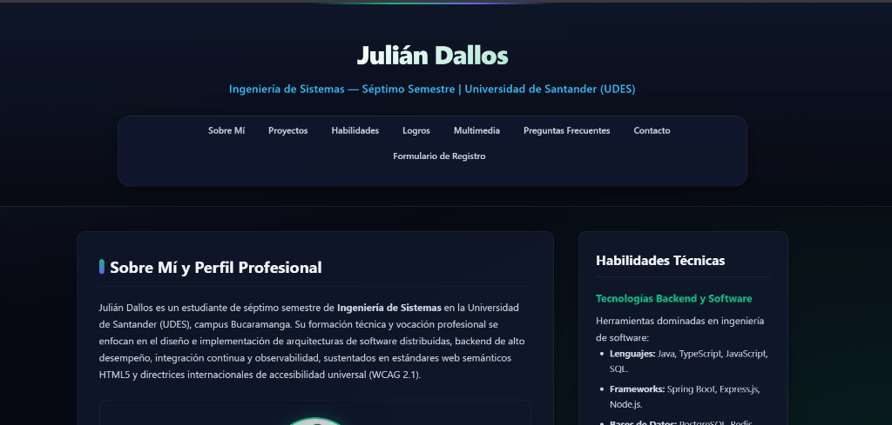
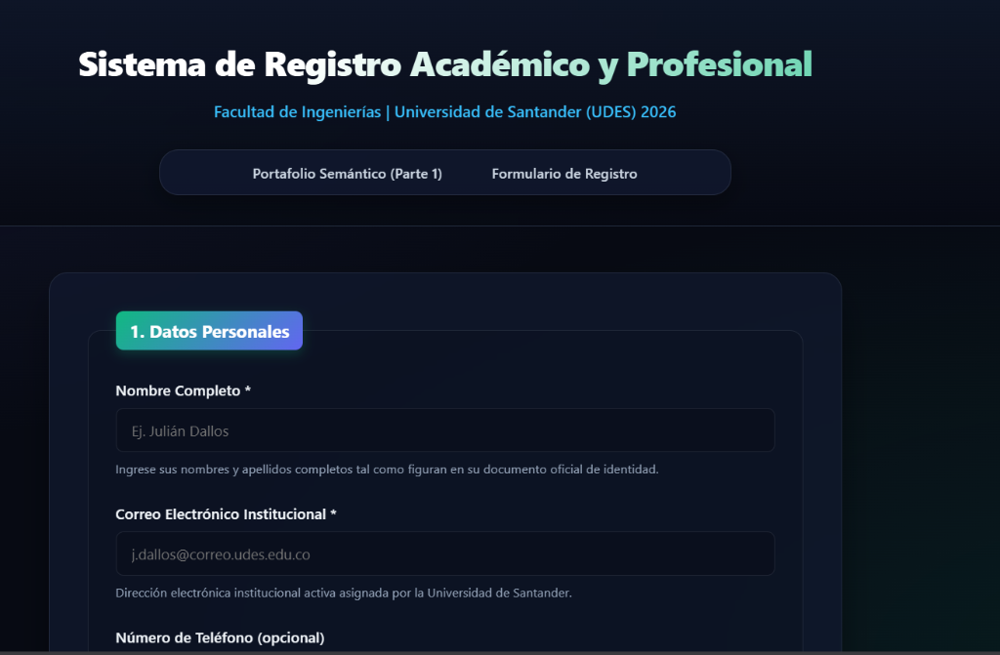

# Laboratorio Post-Contenido: Semántica Web, Accesibilidad y Formularios Avanzados (Unidad 2)

[](https://validator.w3.org/)
[](https://www.w3.org/WAI/standards-guidelines/wcag/)
[](https://udes.edu.co/)
[](https://github.com/dallosjulian/dallos-post1-u2)

Este repositorio contiene la solución técnica y pedagógica completa del laboratorio de post-contenido correspondiente a la **Unidad 2: Programación Web (HTML5 Semántico, Accesibilidad Universal WCAG 2.1 y Formularios Nativos Avanzados)**, desarrollado para el programa de Ingeniería de Sistemas de la **Universidad de Santander (UDES)**, sede Bucaramanga.

---

## Información del Estudiante y Proyecto

- **Estudiante:** Julián Dallos
- **Programa Académico:** Ingeniería de Sistemas — Séptimo Semestre (7.°)
- **Institución:** Universidad de Santander (UDES)
- **Asignatura:** Programación Web / Ingeniería Web
- **Año Académico:** 2026
- **Nombre del Repositorio:** `dallos-post1-u2`

---

## Estructura del Repositorio

```text
dallos-post1-u2/
├── .gitignore
├── README.md
├── parte-1-pagina-semantica/
│   ├── index.html
│   ├── video/
│   │   └── intro-es.vtt
│   └── img/
│       ├── perfil.jpg
│       ├── miniatura-intro.jpg
│       └── captura-01.png
└── parte-2-formulario-registro/
    ├── registro.html
    └── img/
        └── captura-01.png
```

---

## 1. Resumen Técnico de la Solución

### Parte 1 — Estructura Semántica, SEO y Accesibilidad Multimedia (`parte-1-pagina-semantica/`)

La primera sección implementa un portafolio web académico y profesional estructurado bajo las directrices del **W3C** y el estándar **HTML5**, eliminando divisiones genéricas innecesarias (`<div>`) para la jerarquía primaria y priorizando la accesibilidad universal:

1. **Metadatos y Optimización SEO:**
   - Declaración de idioma `<html lang="es">`, codificación `UTF-8` y configuración `viewport` para diseño responsivo.
   - Metadato de descripción optimizado estrictamente a **156 caracteres** reales adaptados a Julián Dallos para su correcta visualización en motores de búsqueda (SERP).
   - Título de pestaña conciso y descriptivo de **60 caracteres** (`Julián Dallos | Portafolio Web e Ingeniería de Sistemas UDES`).
   - Directiva de indexación `robots="index, follow"` y autoría formal.
2. **Jerarquía Semántica Estricta:**
   - `<header>` institucional con título de nivel superior `<h1>` y descripción académica.
   - **Doble sistema de navegación** claramente diferenciado mediante ARIA: `<nav aria-label="Navegación principal">` y `<nav aria-label="Navegación del pie de página">` con enlaces ancla directos (`#sobre-mi`, `#proyectos`, `#habilidades`, `#logros`, `#multimedia`, `#preguntas-frecuentes`, `#contacto`).
   - `<main>` como contenedor unificado del flujo informativo principal, subdividido en secciones temáticas autocontenidas.
   - `<section id="sobre-mi">`: Biografía profesional de Julián Dallos redactada en tercera persona, acompañada de `<figure>`, elemento `` con atributos descriptivos (`alt`, `width="150"`, `height="150"`, `loading="eager"`) y leyenda semántica `<figcaption>`.
   - `<section id="proyectos">`: Artículos `<article>` independientes para proyectos de software (*Sistema de Gestión de Inventarios en la Nube* y *Microservicio de Procesamiento de Pagos Seguros*), con marcas temporales legibles por máquinas (`<time datetime="YYYY-MM-DD">`), tecnologías utilizadas y enlaces seguros externos con `target="_blank"` y `rel="noopener noreferrer"`.
   - `<aside id="habilidades">`: Barra lateral con contenido técnico real organizado en tres tipos de listas:
     - Lista no ordenada (`<ul>`): Tecnologías de Software y Backend dominadas.
     - Lista ordenada (`<ol>`): Ciclo de desarrollo, arquitectura y despliegue continuo de software.
     - Lista de definición (`<dl>`, `<dt>`, `<dd>`): Glosario técnico con términos clave (*Semántica Web*, *Accesibilidad WCAG 2.1* y *Clean Code*).
   - `<section id="logros">` (**Decisión de Diseño 1 - Opción A**): Modelado de certificaciones técnicas mediante elementos `<article>` independientes con marcas temporales `<time>`.
   - `<section id="multimedia">` (**Decisión de Diseño 2 - Opción A**): Elemento `<video>` accesible con atributo `poster`, carga multiformato (`.mp4`, `.webm`), pista de subtítulos sincronizados `<track kind="captions" src="video/intro-es.vtt" srclang="es" label="Español" default>` y enlace de descarga de respaldo.
   - `<section id="preguntas-frecuentes">`: Bloques nativos interactivos `<details>/<summary>` colapsables sin JavaScript, con términos clave destacados mediante la etiqueta semántica `<mark>`.
   - `<footer>` con identificador `id="contacto"`, metadatos de contacto y ubicación estructurados mediante `<address>`, enlaces directos `mailto:` y perfil de GitHub, navegación secundaria y copyright formal en `<small>`.



---

### Parte 2 — Formulario de Registro con Validación Nativa y Accesibilidad (`parte-2-formulario-registro/`)

La segunda sección implementa un formulario de registro académico robusto, completamente accesible y validado en el cliente utilizando exclusivamente capacidades nativas de HTML5:

1. **Estructura Modular en 4 `<fieldset>` con `<legend>`:**
   - **1. Datos Personales:** Nombre completo (`minlength`/`maxlength`), correo institucional (`type="email"`), teléfono de contacto (`type="tel"` con patrón internacional/nacional) y fecha de nacimiento con rango universitario (`min="1950-01-01"` y `max="2008-12-31"`).
     - **Decisión de Diseño 3 (Campo Opcional):** Aplicación de la **Opción A**, señalando explícitamente el texto `(opcional)` dentro de la etiqueta `<label for="telefono">`.
   - **2. Datos de Cuenta y Seguridad:** Código estudiantil con expresión regular estricta (`pattern="[0-9]{7}"`), contraseña de alta complejidad con validación por patrón (`pattern="(?=.*[a-z])(?=.*[A-Z])(?=.*[0-9]).{8,}"`) y URL de GitHub (`type="url"`).
   - **3. Información Académica:** Semestre en curso (`type="number"` del 1 al 10), promedio ponderado acumulado con precisión decimal (`step="0.1"`, rango 0.0 a 5.0), modalidad/jornada académica mediante radio buttons agrupados (`role="radiogroup"`) y menú desplegable `<select>` estructurado con `<optgroup>` para pregrados y posgrados.
   - **4. Preferencias y Perfil:** Control deslizante de experiencia (`type="range"`) vinculado bidireccionalmente a la etiqueta nativa `<output id="exp-valor">`, selector de color temático (`type="color"`), casillas de verificación de intereses técnicos (`type="checkbox"`), carga de archivo fotográfico (`type="file"` con filtro `accept`), área de texto para biografía (`<textarea maxlength="500">`) y confirmación obligatoria de términos institucionales.
2. **Campos Ocultos del Sistema:**
   - `<input type="hidden" name="origen" value="portafolio-html5-u2">`
   - `<input type="hidden" name="version_formulario" value="1.0">`
3. **Accesibilidad y Vinculación Estricta:**
   - Vinculación unívoca de cada etiqueta `<label for="...">` con su correspondiente identificador `id`.
   - Párrafos de ayuda y contexto vinculados mediante el atributo `aria-describedby` en todos los controles interactivos.
   - Mensajes explicativos de formato definidos a través del atributo `title` en campos con expresiones regulares.



---

## 2. Decisiones de Diseño y Justificación Teórica

De acuerdo con los lineamientos de la guía del laboratorio y la rúbrica de evaluación **R2-Lab**, se documentan y justifican formalmente las tres decisiones de diseño implementadas:

### Decisión 1: Modelado de Logros y Certificaciones como `<article>` (Opción A)

> **Justificación Semántica:**  
> Según la especificación oficial de HTML5 del W3C y la guía pedagógica de la asignatura, el elemento `<article>` representa una composición autónoma y autocontenida dentro de un documento, concebida para ser distribuida, reutilizada o sindicada de manera independiente (por ejemplo, en lectores RSS, agregadores de noticias o extractos de perfil profesional).  
> Cada certificación técnica de Julián Dallos cuenta con título propio, fecha exacta de expedición (`<time datetime="...">`), entidad emisora, descripción temática y enlace de verificación externo. Por ende, satisface afirmativamente la pregunta metodológica de diseño: *¿Tiene sentido y valor informativo este bloque por sí solo fuera del contexto de la página principal?* Utilizar una sección genérica restaría autonomía al logro, mientras que estructurarlo como `<article>` potencia el significado semántico y la interoperabilidad web.

### Decisión 2: Presentación Multimedia con Subtítulos WebVTT (Opción A)

> **Justificación de Accesibilidad:**  
> La integración del elemento nativo `<video>` complementado con pistas `<track kind="captions">` en formato WebVTT (`intro-es.vtt`) cumple de forma directa con el **Principio 1: Perceptible** de las Pautas de Accesibilidad para el Contenido Web (**WCAG 2.1 Nivel AA**, Criterio de Éxito 1.2.2 "Subtítulos pregrabados").  
> Esta decisión garantiza que estudiantes, docentes y evaluadores con discapacidad auditiva, o aquellos que navegan en entornos con restricciones sonoras, perciban la totalidad del mensaje transmitido. Además, se incluyó un contenedor contextual `<figure>` con `<figcaption>` para otorgar jerarquía semántica y un enlace de descarga alternativo (*fallback*) para navegadores legados o conexiones de baja velocidad.

### Decisión 3: Marcado de Campo Opcional para Teléfono en `<label>` (Opción A)

> **Justificación de Usabilidad y Accesibilidad Universal:**  
> En el diseño de formularios web inclusivos, la convención estándar establece que los campos obligatorios se identifican visualmente con un asterisco (`*`) o mediante el atributo `required`. Sin embargo, para campos no obligatorios como el número telefónico, incorporar explícitamente el texto **"(opcional)"** dentro de la etiqueta `<label for="telefono">` ofrece máxima claridad cognitiva.  
> Esta práctica no depende de la interpretación de hojas de estilo ni del soporte variable de lectores de pantalla ante atributos secundarios, comunicando de manera instantánea la opcionalidad del campo a cualquier usuario antes de interactuar con el control.

---

## 3. Instrucciones de Clonación, Ejecución y Validación

### Requisitos Previos

- Navegador web moderno compatible con HTML5 (Google Chrome, Mozilla Firefox, Microsoft Edge o Safari).
- Visual Studio Code con la extensión **Live Server** instalada.
- Git configurado en el entorno de desarrollo.

### Pasos de Ejecución Local

1. **Clonar el repositorio:**

   ```bash
   git clone https://github.com/dallosjulian/dallos-post1-u2.git
   cd dallos-post1-u2
   ```

2. **Abrir el proyecto en Visual Studio Code:**

   ```bash
   code .
   ```

3. **Iniciar con Live Server:**
   - Hacer clic derecho sobre `parte-1-pagina-semantica/index.html` y seleccionar **"Open with Live Server"** (o utilizar el atajo de teclado `Alt + L, Alt + O`).
   - Navegar entre la página principal y el formulario de registro utilizando los enlaces de la barra de navegación.

### Validación de Estándares W3C

Para verificar la conformidad técnica de los documentos HTML:

1. Ingresar al servicio oficial de validación del W3C: [https://validator.w3.org/nu/](https://validator.w3.org/nu/).
2. Seleccionar la modalidad **"File Upload"** o **"Text Input"**.
3. Cargar sucesivamente los archivos `parte-1-pagina-semantica/index.html` y `parte-2-formulario-registro/registro.html`.
4. **Resultado esperado:** `Document checking completed. No errors or warnings to show.` (0 errores, 0 advertencias).

---

## 4. Historial Secuencial de Commits de Git

A continuación se detalla el flujo secuencial de comandos Git recomendado para la gestión y publicación del repositorio:

```bash
# 1. Inicialización del repositorio local
git init

# 2. Configuración de exclusiones del sistema
git add .gitignore
git commit -m "chore: configurar .gitignore para archivos del sistema y entornos de desarrollo"

# 3. Creación de la estructura base del proyecto
git add parte-1-pagina-semantica/ video/ img/
git commit -m "feat(parte-1): estructurar directorio base y recursos de la pagina semantica"

# 4. Implementación de subtítulos WebVTT
git add parte-1-pagina-semantica/video/intro-es.vtt
git commit -m "feat(parte-1): anadir archivo de subtitulos sincronizados WebVTT intro-es.vtt"

# 5. Maquetación y desarrollo de la página semántica (Parte 1)
git add parte-1-pagina-semantica/index.html
git commit -m "feat(parte-1): implementar estructura semantica HTML5, metadatos SEO, listas y multimedia accesible"

# 6. Creación de recursos y estructura de la Parte 2
git add parte-2-formulario-registro/ img/
git commit -m "feat(parte-2): inicializar modulo de formulario de registro y directorio de recursos"

# 7. Implementación del formulario de registro (Parte 2)
git add parte-2-formulario-registro/registro.html
git commit -m "feat(parte-2): implementar formulario con 4 fieldsets, >10 tipos de input, range reactivo y validacion nativa"

# 8. Documentación institucional completa
git add README.md
git commit -m "docs: anadir documentacion tecnica integral, justificacion de decisiones y guia de ejecucion"

# 9. Vinculación y publicación en repositorio remoto de GitHub
git branch -M main
git remote add origin https://github.com/dallosjulian/dallos-post1-u2.git
git push -u origin main
```

---

## 5. Conclusiones Académicas

La realización de este laboratorio reafirma que el desarrollo web profesional en la **Ingeniería de Sistemas** trasciende la mera presentación visual. El uso disciplinado del estándar HTML5 semántico, la integración de subtítulos accesibles mediante WebVTT y la construcción de formularios con validación nativa y atributos ARIA constituyen los pilares de un software accesible, mantenible, seguro y de alto rendimiento. Estos principios garantizan la interoperabilidad universal de las soluciones web desarrolladas desde la Universidad de Santander (UDES) frente a cualquier dispositivo, navegador o tecnología de asistencia contemporánea.
